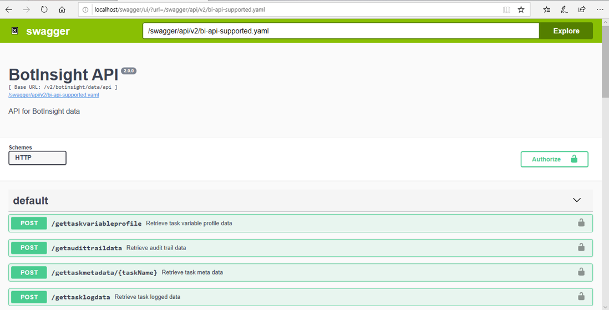
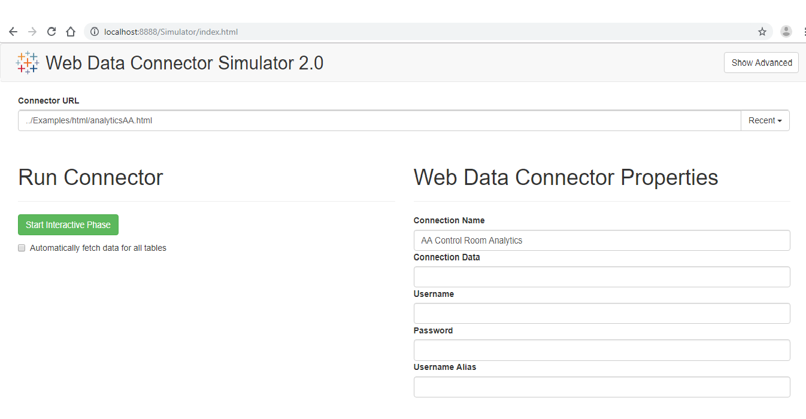
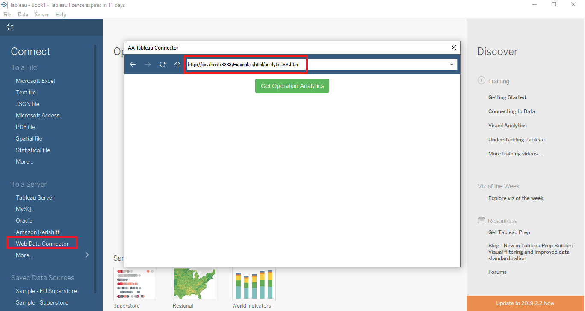

# AA_BotInsight_Tableau_WDC


This repository will show he quickly we can integrate the Automation Anywhere Bot Insight API with Tableau using a Web Data Connector (WDC API)

You can get the complete list of API's here

http://YOUR-CONTROL-ROOM-ADDRESS:PORT/swagger/


For the sake of simplicity, we will be using `/v2/botinsight/data/api/getaudittraildata` API to get the audit trail for a particular day and visualize it in Tableau



## Tableau

You can download and install any version (https://www.tableau.com/support/releases) of Tableau desktop to follow along with this guide.

## Node JS
You can install any LTS version of NodeJS (https://nodejs.org/en/) at the time of you reading this document

## Steps for writing WDC

1. Clone the code

```
git clone https://github.com/saichandu415/AA_BotInsight_Tableau_WDC.git
```
2. All you need is to create a .html file and .js file in the /Examples/html & /Examples/js folder respective to your connector. In this scenario we have `analyticsAA.html` and `analyticsAA.js`

3. The core functionality is implemented in the .js file within 4 steps

    1. Make connector
    2. Create getSchema implementation
        This creates the Table schema in tableau.  It is just the representation of the JSON response for tableau columns
    3. Create getData implementation
        Here we make the necessary AJAX Calls to get the data from API's and transform them to the Table Schema
        > During the implementation make sure the [Authentication](https://github.com/saichandu415/AA_BotInsight_Tableau_WDC#authentication) is called first then any of the BOTINSIGHT API's
    4. Register connector

4. We need to understand the API's we are going to make connector for, In this case the flow is we create the authentication token from `/v1/authentication` and we use it within the header of the `/v2/botinsight/data/api/getaudittraildata` We will implement the same in the connector

Below is the postman requests

### Authentication
```
POST /v1/authentication HTTP/1.1
Host: AABLR0183.AASPL-BRD.COM:80
Content-Type: application/json
User-Agent: PostmanRuntime/7.15.0
Accept: */*
Cache-Control: no-cache
Postman-Token: 2b282410-4d63-4d56-8506-564b6a37732f,6593d3ae-bd58-4ea3-a909-4324a4efa314
Host: aablr0183.aaspl-brd.com:80
accept-encoding: gzip, deflate
content-length: 59
Connection: keep-alive
cache-control: no-cache

{
  "username": "username",
  "password": "password"
}
```

### GET AUDIT TRAIL DATA
```
POST /v2/botinsight/data/api/getaudittraildata HTTP/1.1
Host: AABLR0183.AASPL-BRD.COM:80
X-Authorization: **place token from authentication** 
Content-Type: application/json
User-Agent: PostmanRuntime/7.15.0
Accept: */*
Cache-Control: no-cache
Postman-Token: d787990a-4627-4874-9e9d-f12d20dfd7e2,13a79b68-9031-40bd-aa6d-158c503ddd49
Host: aablr0183.aaspl-brd.com:80
accept-encoding: gzip, deflate
content-length: 27
Connection: keep-alive
cache-control: no-cache

{
  "date":"2019-07-23"
}
```

5. You can find all the samples of the code [here](./Examples/js/analyticsAA.js). The methods are quite self explanatory 

#### getSchema
```javascript
// Define the schema
    myConnector.getSchema = function (schemaCallback) {

        var cols = [{
            id: "id",
            alias: "unique ID",
            dataType: tableau.dataTypeEnum.string
        }, {
            id: "eventDescription",
            alias: "Event Description",
            dataType: tableau.dataTypeEnum.string
        }, {
            id: "activityType",
            alias: "Activity Type",
            dataType: tableau.dataTypeEnum.string
        }, {
            id: "environmentName",
            alias: "Environment Name",
            dataType: tableau.dataTypeEnum.string
        }, {
            id: "hostName",
            alias: "Host Name",
            dataType: tableau.dataTypeEnum.string
        }, {
            id: "userName",
            alias: "User Name",
            dataType: tableau.dataTypeEnum.string
        }, {
            id: "status",
            alias: "Status",
            dataType: tableau.dataTypeEnum.string
        }, {
            id: "source",
            alias: "Source",
            dataType: tableau.dataTypeEnum.string
        }, {
            id: "objectName",
            alias: "ObjectName",
            dataType: tableau.dataTypeEnum.string
        }, {
            id: "detail",
            alias: "Detail",
            dataType: tableau.dataTypeEnum.string
        }, {
            id: "createdOn",
            alias: "Created On",
            dataType: tableau.dataTypeEnum.datetime
        }, {
            id: "requestId",
            alias: "Request Id",
            dataType: tableau.dataTypeEnum.string
        }, {
            id: "createdBy",
            alias: "Created By",
            dataType: tableau.dataTypeEnum.string
        }];

        var tableSchema = {
            id: "operationAnalytics",
            alias: "CR operation Analytics",
            columns: cols
        };

        schemaCallback([tableSchema]);
    };
```


#### getData
```javascript

myConnector.getData = function (table, doneCallback) {
        var postBody = {
            date: "2019-07-23"
        };

        var authenticateBody = {
            username: "username",
            password: "password"
        };

        // Console.log doesn't work in Tableau
        // tableau.log("My console message goes here!");

        $.ajax({
            // using Authentication API for obtaining token
            url: 'http://localhost:8889/localhost/v1/authentication',
            headers: {
                "Content-Type": "application/json"
            },
            method: 'POST',
            dataType: 'json',
            async: false,
            data: JSON.stringify(authenticateBody),
        }).done(function (authenticationData) {
            // Calling getAudittraildata API
            $.ajax({
                url: 'http://localhost:8889/localhost/v2/botinsight/data/api/getaudittraildata',
                headers: {
                    // using the authentication token from the previous call
                    'X-Authorization': authenticationData.token,
                    'Access-Control-Allow-Origin': 'http://localhost:8888'
                },
                method: 'POST',
                dataType: 'json',
                async: false,
                data: JSON.stringify(postBody),
            }).done(function (data) {
                var feat = data.list,
                    tableData = [];

                // Iterate over the JSON object
                for (var i = 0, len = feat.length; i < len; i++) {
                    tableData.push({
                        "id": feat[i].id,
                        "eventDescription": feat[i].eventDescription,
                        "activityType": feat[i].activityType,
                        "environmentName": feat[i].environmentName,
                        "hostName": feat[i].hostName,
                        "userName": feat[i].userName,
                        "status": feat[i].status,
                        "source": feat[i].source,
                        "objectName": feat[i].objectName,
                        "detail": feat[i].detail,
                        "createdOn": feat[i].createdOn,
                        "requestId": feat[i].requestId,
                        "createdBy": feat[i].createdBy,
                    });
                }

                table.appendRows(tableData);
                doneCallback();

            }).fail(function (msg) {
                tableau.log(msg);
            });

        });
```

6. Testing in simulator
http://localhost:8888/Simulator/index.html


7. Testing in Tableau

Once opened in tableau choose Web Data Connector update the simulator URL within the browser and click `Get Operation Analytics`



### Bugs & Feedback
For bugs, questions and discussions please use the [Github Issues](https://github.com/saichandu415/AA_BotInsight_Tableau_WDC/issues)

### Useful Links
- https://www.automationanywhere.com/in/products/bot-insight
- https://www.getpostman.com/
- https://tableau.github.io/webdataconnector/docs/wdc_debugging
- https://github.com/tableau/webdataconnector
